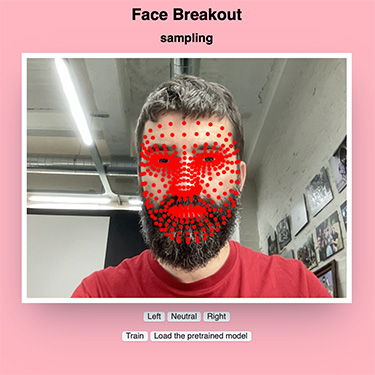
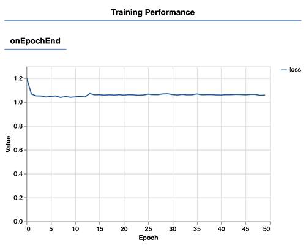
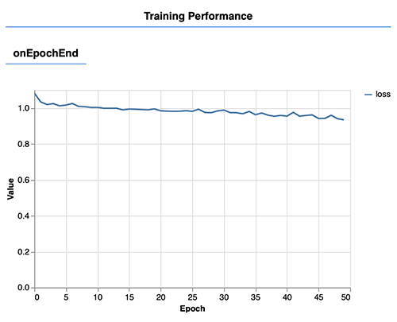
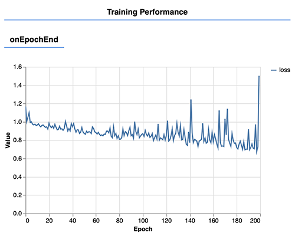
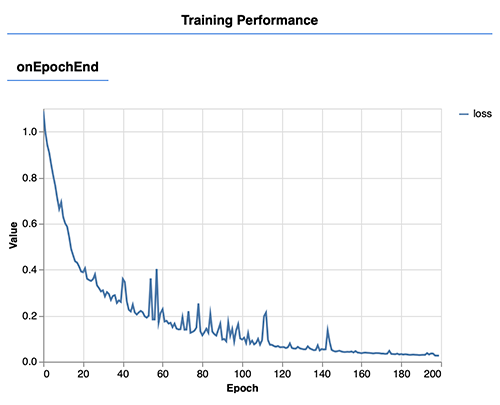
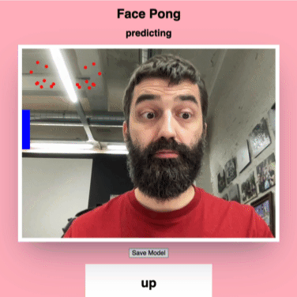

# ML5

## Examples

- [Body Pose](./demos/01-bodypose-vanilla-js.html)
- [Body Segmentation](./demos/02-body-segmentation-vanilla-js.html)
- [Hand Pose](./demos/03-handpose-vanilla-js.html)
- [Face Mesh](./demos/04-facemesh-vanilla-js.html)
- [Image Classifier](./demos/05-image-classifier-vanilla-js.html)
- [Sound Classifier](./demos/06-sound-classifier-vanilla-js.html)
- [Sentiment Analysis](./demos/07-sentiment-analysis-vanilla-js.html)
- [Teachable Machine](./demos/08-teachable-machine-image-classifier.html)
- [Neural Network Rock-Paper-Scissors](./demos/09-neural-network-rock-paper-scissors.html)

## Exercise - Face Pong

We'll build a version of the "Pong" arcade game, which we'll control with our eyebrows.

Let's combine the Face Mesh model with a Neural Network to control the paddle.

### Step 1: Setup

Create a copy of the [Neural Network Rock-Paper-Scissors](./demos/09-neural-network-rock-paper-scissors.html) and make some adjustments.

1. Change the title and h1 to "Face Pong".
2. Change the buttons, so they say "up", "neutral", and "down". Make sure to update the ids and variable names as well and change the values you pass into the `sample()` function. **VS Code Tip**: Use `Ctrl + D` to select all occurrences of the same word. Additionally, you can right-click on a variable and select "rename symbol" to change all occurrences of that variable.
3. Change the `handPose` and `hands` variables to `faceMesh` and `faces`.
4. Load the Face Mesh model instead of the Hand Pose model.
5. Make the circles a bit smaller in your drawVideoWithKeyPoints function. You should see your face points on the screen.



### Step 2: Training our initial model

Let's try training our model to recognize when we:

- Raise our eyebrows (move the paddle up)
- Neutral (keep the paddle in the middle)
- Lower our eyebrows (move the paddle down)

Take a lot of sample for these 3 classes and hit the train button. We're getting this loss function:



The loss doesn't really go down, and the model doesn't seem to work. There's a couple of strategies you can take when this happens:

- Improve the quality of your data
- Change the model architecture
- Train for a longer time
- Change the learning rate

### Step 3: Improving our data

Right now, we are passing a lot of irrelevant points to the model. We're only interested in the positions of our eyebrows vs our eyes.

As we will need these keypoints in multiple places, let's create a function that will return the keypoints we need.

```javascript
const getRelevantKeyPoints = (face) => {
  return [
    ...face.leftEye.keypoints,
    ...face.leftEyebrow.keypoints,
    ...face.rightEye.keypoints,
    ...face.rightEyebrow.keypoints,
  ];
};
```

We could even reduce the number of keypoints, by just taking every 3rd keypoint:

```javascript
const getRelevantKeyPoints = (face) => {
  return [
    ...face.leftEye.keypoints.filter((keypoint, index) => index % 3 === 0),
    ...face.leftEyebrow.keypoints.filter((keypoint, index) => index % 3 === 0),
    ...face.rightEye.keypoints.filter((keypoint, index) => index % 3 === 0),
    ...face.rightEyebrow.keypoints.filter((keypoint, index) => index % 3 === 0),
  ];
};
```

Let's try training our model again with this reduced set of data. Don't forget to use this `getRelevantKeyPoints(face)` function in your `sample()` and prediction logic:

```javascript
const keypoints = getRelevantKeyPoints(faces[0]).map(keypoint => [keypoint.x, keypoint.y]).flat();
```

The loss function goes down, but it seems like the training needs more time to finish:



Increase the number of epochs to 200 and try training again:

```javascript
const options = {
  epochs: 200,
};
classifier.train(options, whileTraining, finishedTraining);
```



The loss function goes down further, but not fast enough. However, there's one more trick we can apply to our input data.

### Step 4: Normalizing our data

We want the model to work regardless of the position of our face on the screen.

First of all, let's make sure our eyes are always positioned on the top-left of the canvas, no matter where our face is on the screen. We can do so by subtracting the minimum x and y values from all the keypoints:

```javascript
const getRelevantKeyPoints = (face) => {
  const keypointMap = (keypoint) => {
    return {
      x: keypoint.x - face.box.xMin,
      y: keypoint.y - face.box.yMin,
      z: keypoint.z
    }
  };
  return [
    ...face.leftEye.keypoints.filter((keypoint, index) => index % 3 === 0).map(keypointMap),
    ...face.leftEyebrow.keypoints.filter((keypoint, index) => index % 3 === 0).map(keypointMap),
    ...face.rightEye.keypoints.filter((keypoint, index) => index % 3 === 0).map(keypointMap),
    ...face.rightEyebrow.keypoints.filter((keypoint, index) => index % 3 === 0).map(keypointMap),
  ];
};
```

You should see your face points on the top-left of the screen. There's one more issue though: if we move closer and further from the screen, the distance between our eyes and eyebrows will change. We can normalize the distance between our eyes and eyebrows by dividing all the y values by the distance between our eyes:

```javascript
const getRelevantKeyPoints = (face) => {
  const leftEyeCenter = {
    x: face.leftEye.centerX,
    y: face.leftEye.centerY,
  };
  const rightEyeCenter = {
    x: face.rightEye.centerX,
    y: face.rightEye.centerY,
  };
  // calculate the distance between the eyes, we use this as a distance-based scaling factor
  const eyeDistance = Math.sqrt(
    Math.pow(leftEyeCenter.x - rightEyeCenter.x, 2) +
    Math.pow(leftEyeCenter.y - rightEyeCenter.y, 2)
  );
  const targetDistance = 100;
  const keypointMap = (keypoint) => {
    return {
      x: targetDistance * (keypoint.x - face.box.xMin) / eyeDistance,
      y: targetDistance * (keypoint.y - face.box.yMin) / eyeDistance,
      z: keypoint.z
    }
  };
  return [
    ...face.leftEye.keypoints.filter((keypoint, index) => index % 3 === 0).map(keypointMap),
    ...face.leftEyebrow.keypoints.filter((keypoint, index) => index % 3 === 0).map(keypointMap),
    ...face.rightEye.keypoints.filter((keypoint, index) => index % 3 === 0).map(keypointMap),
    ...face.rightEyebrow.keypoints.filter((keypoint, index) => index % 3 === 0).map(keypointMap),
  ];
};
```

Go through the sampling and training process again. Make sure to capture different angles of your face, to make your model more robust. We're getting a nice loss graph:



Make sure to save your model once you're happy with the results!

You can compare your current state of this excercise with [01-face-pong.html](./exercises/01-face-pong.html).

### Step 5: Adding an intro state

Before we start creating the game, let's add an intro state. We'll present two options to our player: "Start" and "Create Model".

- Start should load the pretrained model and go to our game state (STATE_PREDICTING).
- Create Model should go to the sampling state (STATE_SAMPLING).

Try implementing this logic yourselves, before reading the step-by-step guide below.

Create an extra css selector to show items with the `display-intro` class:

```css
.intro .display-intro {
  display: block;
}
```

Add a div with the `display-intro` class to your html. This div should contain two buttons: "Start" and "Create Model".

```html
<div class="hidden display-intro">
  <button id="start">Start</button>
  <button id="create">Create Model</button>
</div>
```

Define a new `STATE_LOADING`, and make sure to add it to `ALL_STATES`:

```javascript
const STATE_LOADING = "loading";
const STATE_INTRO = "intro";
const STATE_SAMPLING = "sampling";
const STATE_TRAINING = "training";
const STATE_PREDICTING = "predicting";
const ALL_STATES = [
  STATE_LOADING,
  STATE_INTRO,
  STATE_SAMPLING,
  STATE_TRAINING,
  STATE_PREDICTING
];
```

Get references to the two new buttons at the top of your script:

```javascript
const $start = document.querySelector('#start');
const $create = document.querySelector('#create');
```

In the section where you add the event listeners, add the following:

```javascript
$start.addEventListener('click', () => {
  classifier.load(pretrainedModelURL.toString(), () => {
    console.log('model loaded');
    setState(STATE_PREDICTING);
  });
});
$create.addEventListener('click', () => {
  setState(STATE_SAMPLING);
});
```

Finally, replace the `setState(STATE_SAMPLING);` with `setState(STATE_INTRO);` at the end of your `setup()` function.

You should now be able to either go to the game state by pressing the start button or go to the sampling state by pressing the create button. You can compare your version with the solution in [02-face-pong.html](./exercises/02-face-pong.html).

### Step 6: Moving the paddle

We've reached the game-creation part of our exercise! We now have a robust system to detect whether we want to move the paddle up, down, or keep it in the middle. Let's create a simple game where we control the paddle with our eyebrows.

Create 2 new global variables which describe the paddle position and size:

```javascript
const PADDLE_SIZE = 100;
// start with the paddle in the middle
let paddleY = 480 / 2 - PADDLE_SIZE / 2;
```

Update the `drawPredicting()` function to update the paddle position based on the prediction:

```javascript
const drawPredicting = () => {
  drawVideoWithKeyPoints();
  const classification = classificationResults[0]?.label;
  $results.textContent = classification;
  // update the paddle position based on the classification
  if (classification === 'up') {
    paddleY -= 5;
  } else if (classification === 'down') {
    paddleY += 5;
  }
  // draw the paddle
  ctx.fillStyle = 'blue';
  ctx.fillRect(0, paddleY, 20, PADDLE_SIZE);
};
```

You should see the paddle move, based upon your eyebrow movements:



You can compare your current state of this excercise with [03-face-pong.html](./exercises/03-face-pong.html).

### Step 7 - constraining the paddle & adding the ball

We need to make sure the paddle doesn't move outside of the canvas. We can do so by adding the following code to the `drawPredicting()` function:

```javascript
// make sure the paddle doesn't move outside of the canvas
paddleY = Math.max(0, Math.min(paddleY, 480 - PADDLE_SIZE));
```

Next up, create the necessary variables in your global scope for controlling the ball. We need to keep track of the position and the speed of the ball:

```javascript
const BALL_SIZE = 20;
let ballX = 320;
let ballY = 240;
let ballSpeedX = 5;
let ballSpeedY = 5;
```

Update the `drawPredicting()` function to update the ball position and draw it:

```javascript
// update the ball position
ballX += ballSpeedX;
ballY += ballSpeedY;
// draw the ball
ctx.fillStyle = 'green';
ctx.beginPath();
ctx.arc(ballX, ballY, BALL_SIZE, 0, 2 * Math.PI);
ctx.fill();
```

You should see the ball move around the screen. However, it will move off the screen, as we haven't implemented any collision detection with the walls yet.

Update the `drawPredicting()` function to make the ball bounce off the walls:

```javascript
  // update the ball position
  ballX += ballSpeedX;
  ballY += ballSpeedY;
  // make the ball bounce off the walls
  if (ballX - BALL_SIZE / 2 + ballSpeedX < 0 || ballX + BALL_SIZE / 2 + ballSpeedX > canvas.width) {
    ballSpeedX *= -1;
  }
  if (ballY - BALL_SIZE / 2 + ballSpeedY < 0 || ballY + BALL_SIZE / 2 + ballSpeedY > canvas.height) {
    ballSpeedY *= -1;
  }
```

You should now see the ball bounce off the walls. You can compare your current state of this excercise with [04-face-pong.html](./exercises/04-face-pong.html).

### Step 8 - collide with paddle or lose

We need to check if the ball collides with the paddle. If it does, we should make the ball bounce back. If it doesn't, we should go to a lost state.

Update the `drawPredicting()` function to check for collisions with the paddle:

```javascript
// check for collision with the paddle
if (ballX - BALL_SIZE / 2 < 20 && ballY > paddleY && ballY < paddleY + PADDLE_SIZE) {
  ballSpeedX *= -1;
}
```

Additionally, check if the ball goes off the left side of the screen. To do so, remove the bounce logic for that side, and add a seperate check for the ball going off the screen. If it does, reset the ball position and speed, and move to the intro state for now (we'll create a lost state later):

```javascript
// check if we missed the ball
if (ballX - BALL_SIZE / 2 + ballSpeedX < 0) {
  // reset the ball position
  ballX = 320;
  ballY = 240;
  // reset the ball speed
  ballSpeedX = 5;
  ballSpeedY = 5;
  // go to the intro state for now
  setState(STATE_INTRO);
}
// make the ball bounce off the walls
if (ballX + BALL_SIZE / 2 + ballSpeedX > canvas.width) {
  ballSpeedX *= -1;
}
if (ballY - BALL_SIZE / 2 + ballSpeedY < 0 || ballY + BALL_SIZE / 2 + ballSpeedY > canvas.height) {
  ballSpeedY *= -1;
}
```

Once this is working, we can create a lost state:

1. Create a css selector for that state
2. Define a `STATE_LOST` variable and add it to `ALL_STATES`
3. Create a `drawLost()` function and call that one from your `draw()` function when the state is `STATE_LOST`
4. Add a button to restart the game. This button should go back to the `STATE_PREDICTING` state.

You can compare your current state of this excercise with [05-face-pong.html](./exercises/05-face-pong.html).

### Where to go next

Our game is quite simple at the moment. You could add more features to it, such as:

- Add a score counter for each time you bounce the ball off the paddle
- Add a countdown before the game starts
- Cleaning up the graphics
- Adding sound effects